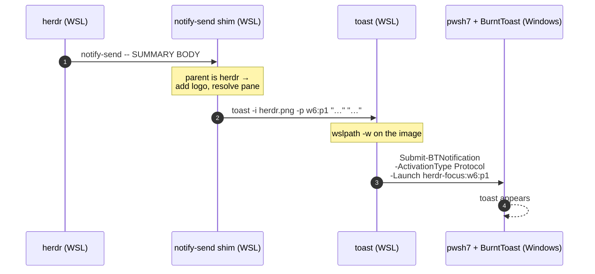
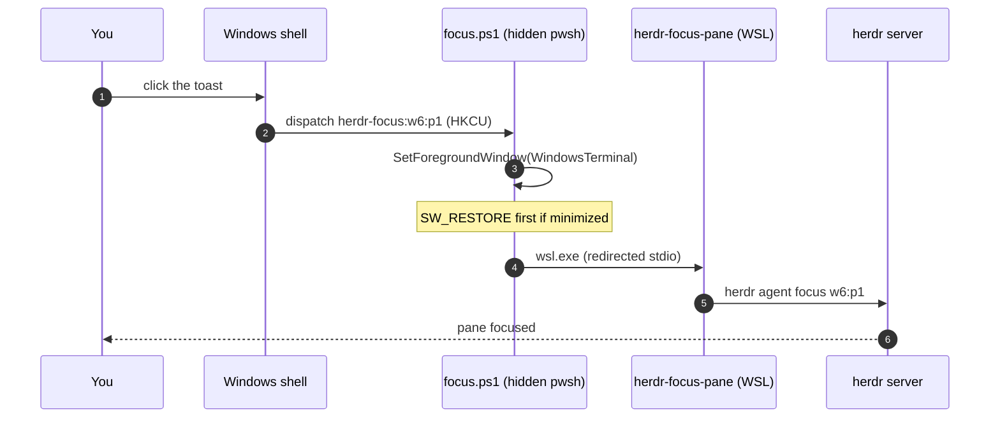

# Architecture

Two independent halves: sending a toast (WSL → Windows) and handling a click
(Windows → WSL). They meet at a URI string embedded in the notification.

## Outbound: WSL to the Windows desktop



## Inbound: click to terminal and pane



## Components

| File | Side | Role |
| --- | --- | --- |
| `bin/toast` | WSL | Builds and submits the notification |
| `bin/notify-send` | WSL | freedesktop shim; branding + pane matching |
| `bin/herdr-focus-pane` | WSL | Wraps `herdr agent focus`, logs (caller is windowless) |
| `windows/focus.ps1` | Windows | `herdr-focus:` handler: foreground WT, call back into WSL |
| `install.sh` | — | Deploys bins, stages handler, registers protocol, makes icons |

## Why not `New-BurntToastNotification`?

It pins toast activation to the PowerShell AppId — the click *is* "launch
PowerShell". The fix is one layer down in the same module:

```powershell
$c = @(New-BTText -Text 'Title'; New-BTText -Text 'Body')
$b = New-BTBinding -Children $c -AppLogoOverride (New-BTImage -Source $img -AppLogoOverride)
Submit-BTNotification -Content (New-BTContent `
  -Visual (New-BTVisual -BindingGeneric $b) `
  -ActivationType Protocol `
  -Launch 'herdr-focus:w6:p1')      # (1)!
```

1. Any registered URL protocol works here. That single string is the entire
   contract between the two halves of the system.

Same toast, same images, controllable click.

## Observability

Every hop logs, because the failure mode of this system is silence — a hidden
window and a `0` exit code.

| Log | Written by |
| --- | --- |
| `~/.local/state/notify-send-shim.log` | shim (full argv, quoted) |
| `~/.local/state/herdr-focus-pane.log` | WSL focus helper + herdr's JSON reply |
| `%LOCALAPPDATA%\herdr-toast\focus.log` | Windows handler: URI, WT pid, wsl exit |

## Design constraints

!!! info "Host-side only"
    A Docker container has no WSL interop and cannot exec a Windows binary,
    even with `/mnt/c` mounted — the file is visible but `exec` fails. Anything
    routing notifications from a container must hand off to a host-side process
    first. (See local-ai ADR-0009, the incident this rule came from.)
