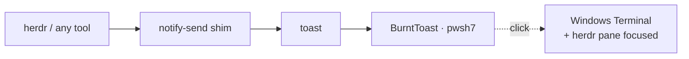

# wsl-toast-bridge

Native Windows toast notifications from WSL — and clicks that come back: focus
the terminal, focus the exact [Herdr](https://herdr.dev) pane, never open a
stray PowerShell window.



## The problem

WSL has no notification daemon, so `notify-send` either doesn't exist or talks
to nobody. Tools that emit desktop notifications — Herdr with
`delivery = "system"`, build scripts, monitors — fail silently.

And the usual fix has a sting of its own: BurntToast's
`New-BurntToastNotification` pins toast activation to the PowerShell AppId, so
clicking the notification opens a useless PowerShell window.

## What you get

<div class="grid cards" markdown>

-   __`toast`__

    Fire a Windows toast from any WSL shell, script, cron job, or systemd unit.

    ```bash
    toast "Build failed" "Check the logs"
    ```

-   __`notify-send` shim__

    Anything speaking freedesktop notifications lands on the Windows desktop
    instead of vanishing into a D-Bus daemon WSL doesn't have.

-   __Click-to-focus__

    Clicking a toast focuses Windows Terminal. Toasts sent for a Herdr agent
    also jump Herdr to that agent's pane.

-   __Branding__

    Herdr toasts get the Herdr logo automatically; `-i` sets any image. Works
    from Windows *and* WSL paths.

</div>

## Requirements

| Requirement | Notes |
| --- | --- |
| Windows 10/11 + WSL2 | interop enabled (default) |
| PowerShell 7 | `pwsh.exe` reachable from the WSL `PATH` |
| [BurntToast](https://github.com/Windos/BurntToast) | `Install-Module BurntToast -Scope CurrentUser` |
| python3 + Pillow | only to draw the bundled warning icon |
| [Herdr](https://herdr.dev) | optional — everything else works without it |

[Install :material-arrow-right:](install.md){ .md-button .md-button--primary }
[Architecture :material-arrow-right:](architecture.md){ .md-button }
